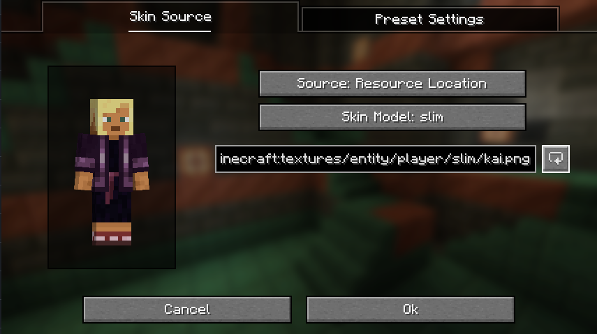
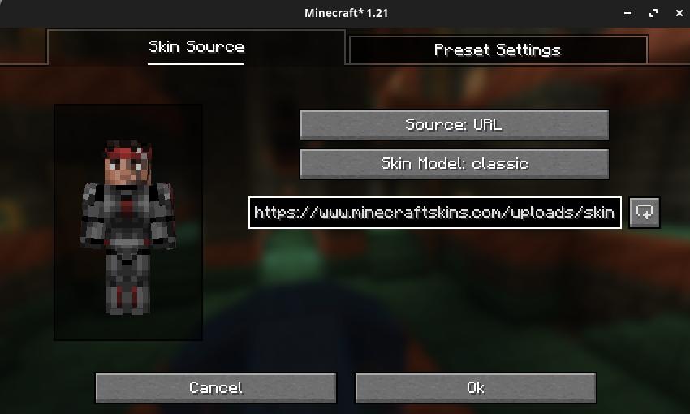
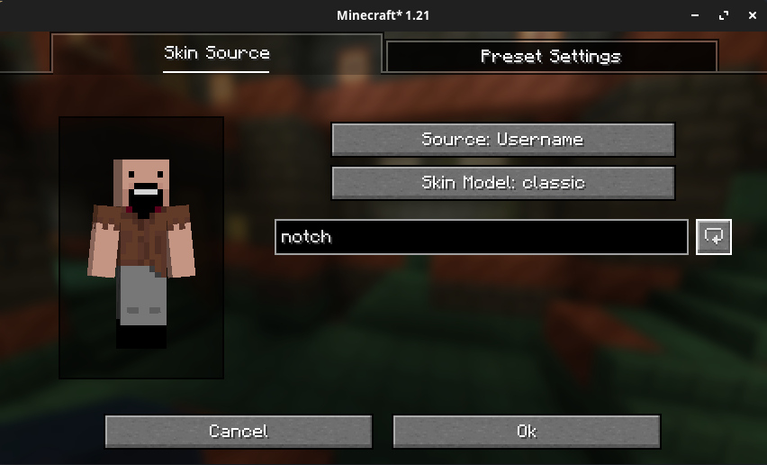
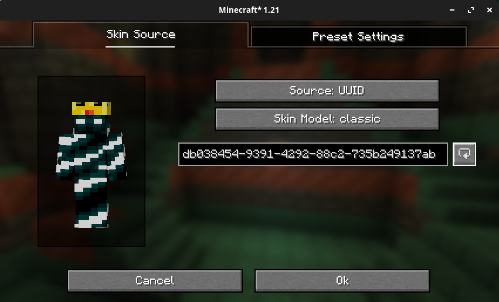
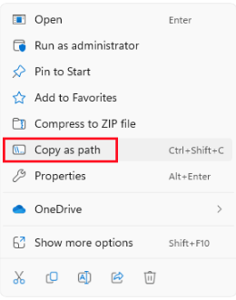

# Skin Preset Editor

The skin preset editor allows you to load skins from a wide range of sources, such as usernames, UUIDs and files.

## Resource Location Source

Simply type the resource location into the text box and click the refresh button to load the skin into the preview.

Vanilla has the following resource locations for skins, you can add more via a resource pack:

- `minecraft:textures/entity/player/wide/alex.png`
- `minecraft:textures/entity/player/wide/ari.png`
- `minecraft:textures/entity/player/wide/efe.png`
- `minecraft:textures/entity/player/wide/kai.png`
- `minecraft:textures/entity/player/wide/makena.png`
- `minecraft:textures/entity/player/wide/noor.png`
- `minecraft:textures/entity/player/wide/steve.png`
- `minecraft:textures/entity/player/wide/sunny.png`
- `minecraft:textures/entity/player/wide/zuri.png`
- `minecraft:textures/entity/player/slim/alex.png`
- `minecraft:textures/entity/player/slim/ari.png`
- `minecraft:textures/entity/player/slim/efe.png`
- `minecraft:textures/entity/player/slim/kai.png`
- `minecraft:textures/entity/player/slim/makena.png`
- `minecraft:textures/entity/player/slim/noor.png`
- `minecraft:textures/entity/player/slim/steve.png`
- `minecraft:textures/entity/player/slim/sunny.png`
- `minecraft:textures/entity/player/slim/zuri.png`

## URL Source

Simply paste the URL into the text box and click the refresh button to load the skin into the preview.

## Username Source

Simply type the username into the text box and click the refresh button to load the username's skin into the preview.

## UUID Source

::: tip
You can find player UUIDs on websites such as [NameMC](https://namemc.com).
:::

Simply type the UUID into the text box and click the refresh button to load the account with the associated UUID's skin into the preview.

## File Source

If you've downloaded a skin texture file from the internet, make sure that it is in `.png` format.

### Windows

On windows, you must right click on the file, and select `Copy as Path`:

### Linux/MacOS

For Linux and MacOS, you can simply right click on the file and select `Copy`.

### Loading the Skin

Next, open the Skin Shuffle preset editor, select the `File` source type, and click the textbox and then paste using <kbd>Ctrl</kbd>+<kbd>V</kbd>.

Finally, use the refresh button to load the skin into the preview before saving the preset.
