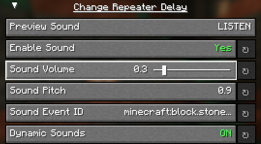

# Configuring Pitch and Volume

Is a sound too loud? Too quiet? Too high pitched? Too low pitched? You can change the pitch and volume of any sound in Sounds' using the configuration screen!

Simply move the slider to the desired pitch or volume, and the sound will be played at that pitch or volume. You can also click the "Preview" button at the top of the group to preview the sound before saving!

If you ever want to go back to the default value, simply click on the reset button next to the option - it will reset the pitch or volume to the default value.
