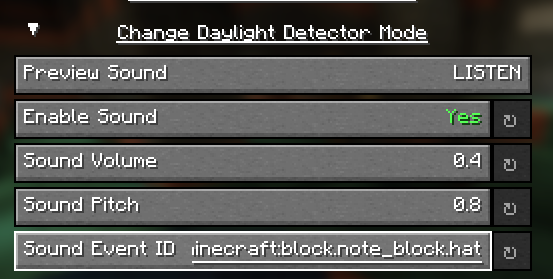
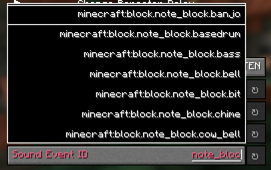
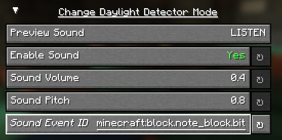

# Configuring Sound Events

Don't like how something Sounds' has added sounds? (Wow, a tounge twister!). You can easily change it within the configuration screen!

::: tip
Before changing the sound event, consider using the `/playsound` or Misode's Sound Library Viewer to see if the sound event is what you want!
:::

To change the sound, simply click on the `Sound Event ID` field, and type in the ID of the sound event you wish to use. The configuration screen will begin suggesting sound events as you type - click on the sound event you want to use if you see it in the suggestions.

Once you've selected a valid sound event ID, the option will return white, indicating that the sound event is valid - you may save the configuration, or continue tweaking other options. You can also click the "Preview" button at the top of the group to preview the sound event before saving!

If you ever want to go back to the default value, simply click on the reset button next to the option - it will reset the sound event ID to the default value.
